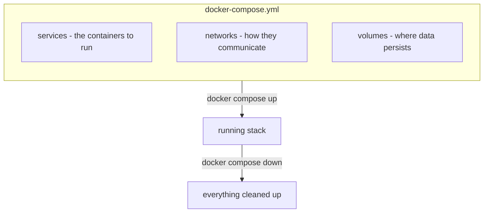
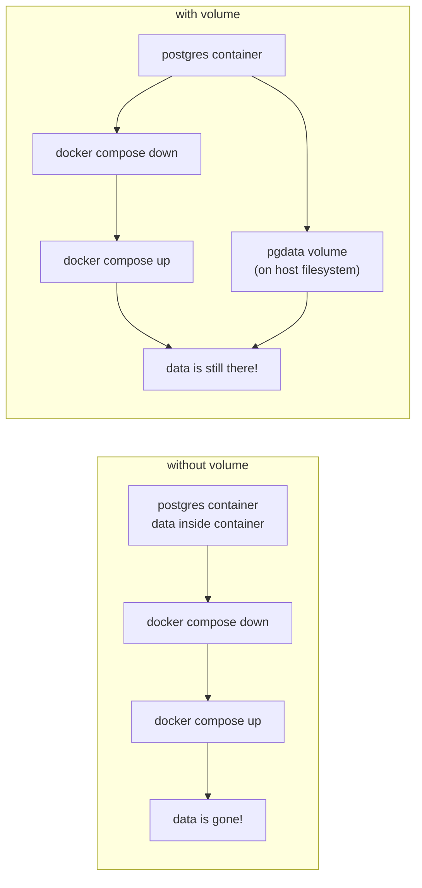

# Docker Compose

---

## Part 1: What Problem Does Compose Solve?

- running multiple containers over the same network 
- sharing a volume for multiple services; providing volume isolation
- simulating non trivial development env
- NOT to be run in production

### The Compose Application Model



**one file defines your entire stack. one command runs it all.**

> reference: [compose application model](https://docs.docker.com/compose/intro/compose-application-model/)

---

## Part 2: Reading the Compose File

### Terminal Demo - Walk Through docker-compose.yml

```bash
# let's look at what we're working with
cat docker-compose.yml
```

### Anatomy of Our Compose File

**walk through each section:**
- `services` — each container we want to run
- `build` vs `image` — build from a Dockerfile or pull a pre-built image
- `depends_on` with `condition: service_healthy` — don't start web until postgres is ready
- `environment` — environment variables passed into the container
- `volumes` — named volume for persistent data
- `healthcheck` — how compose knows the database is actually ready

---

## Part 3: Spinning Up the Stack

### Terminal Demo - docker compose up

```bash
# build images and start everything
docker compose up --build

# watch the output:
# - compose builds the flask image
# - pulls postgres:17 if not cached
# - starts db first (dependency order)
# - waits for db healthcheck to pass
# - then starts web
```

```bash
# Ctrl+C to stop, then run detached
docker compose up --build -d

# check what's running
docker compose ps

# view logs for all services
docker compose logs

# follow logs for just the web service
docker compose logs -f web
```

### Terminal Demo - Test the Running Stack

```bash
# hit the flask app - now with database tracking
curl localhost:5000/
curl localhost:5000/
curl localhost:5000/

# notice the visit_count incrementing?

# check health - should show database: connected
curl localhost:5000/health

# see recent visits
curl localhost:5000/visits
```

---

## Part 4: Volumes - Where Data Lives

### Whiteboard: What Happens Without a Volume?



### Terminal Demo - Proving Persistence

```bash
# we made some visits earlier - let's verify
curl localhost:5000/visits

# take the whole stack down
docker compose down

# everything is stopped
docker compose ps

# but the volume still exists!
docker volume ls | grep pgdata

# bring it back up
docker compose up -d

# our visit data survived!
curl localhost:5000/visits
```

### Terminal Demo - Volume Inspection

```bash
# list all volumes
docker volume ls

# inspect our pgdata volume
docker volume inspect cc-docker-starter_pgdata

# to truly nuke everything including volumes:
docker compose down -v

# now the volume is gone
docker volume ls | grep pgdata
```

**Key point:** `docker compose down` stops and removes containers/networks but **preserves volumes**. add `-v` to also remove volumes.

---

## Part 5: Useful Compose Commands

### Terminal Demo - Day-to-Day Commands

```bash
# start the stack
docker compose up -d

# stop without removing anything
docker compose stop

# start again (no rebuild needed)
docker compose start

# restart a single service
docker compose restart web

# rebuild and restart just one service
docker compose up --build -d web

# view running processes inside services
docker compose top

# shell into a running service
docker compose exec web sh
docker compose exec db psql -U appuser -d appdb

# tear it all down
docker compose down
```

---

## Wrap-up

### Whiteboard: Compose Cheat Sheet

| command | description |
|---------|-------------|
| `docker compose up -d` | start the stack (detached) |
| `docker compose up --build -d` | rebuild images and start |
| `docker compose down` | stop and remove containers/networks |
| `docker compose down -v` | same as above + remove volumes |
| `docker compose ps` | list running services |
| `docker compose logs -f` | follow logs for all services |
| `docker compose exec SERVICE sh` | shell into a service |
| `docker compose stop` / `start` | stop/start without removing |

