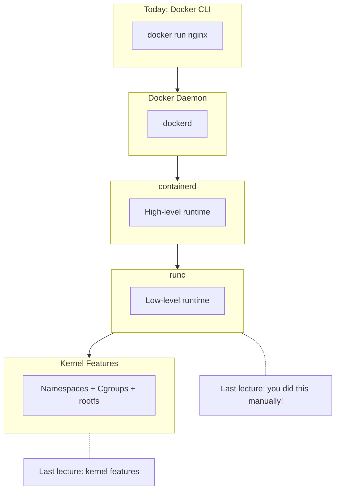
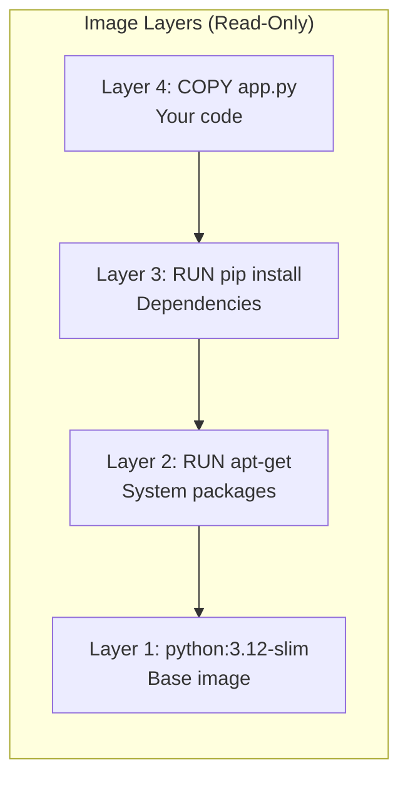
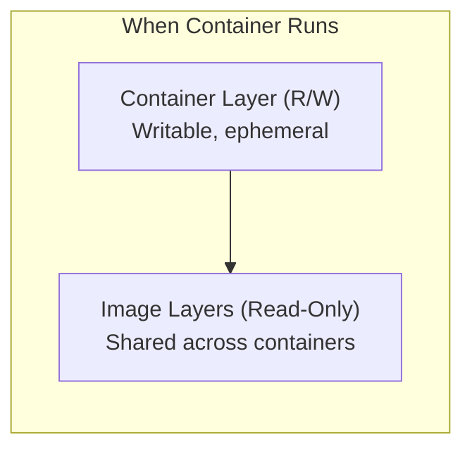
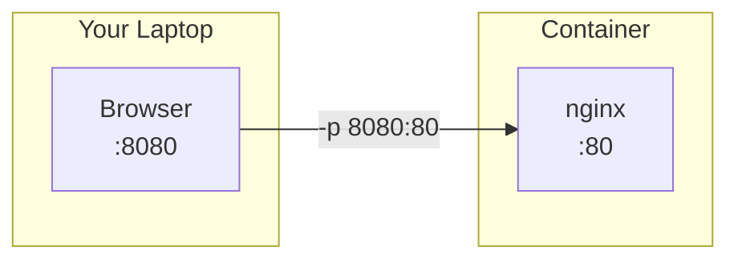
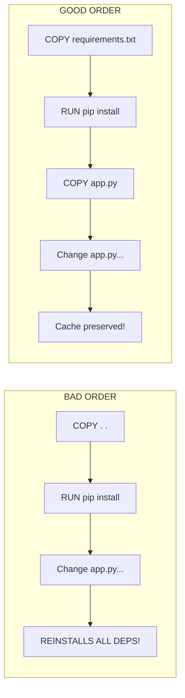
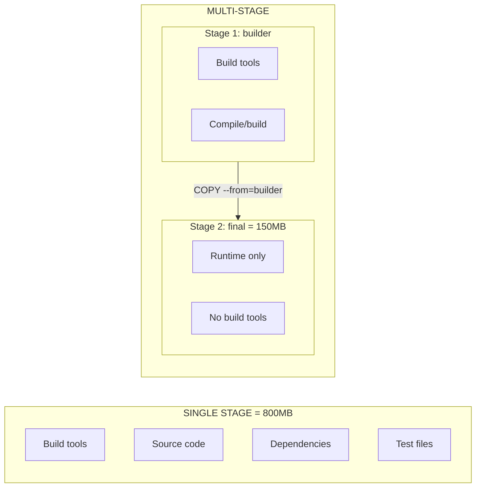
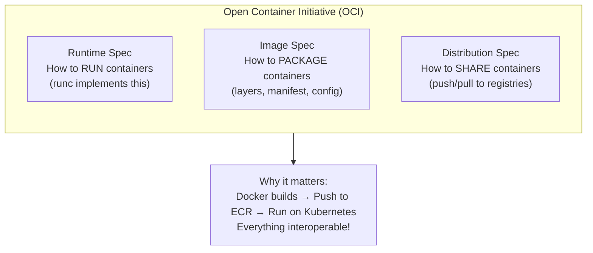
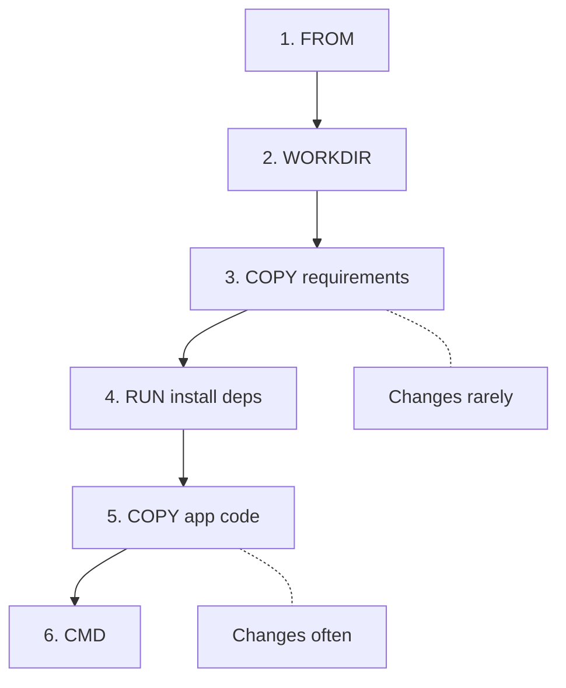

# Docker Deep Dive

---

## Part 1: Connection to Fundamentals

### Whiteboard: Docker Architecture Stack



**Key point:** "Last week you created containers the hard way with unshare, cgroups, and runc. Docker automates all of that."

**Discussion (5 min):**
- Ask: "What did runc need to create a container?" (config.json + rootfs)
- Docker builds that config.json and rootfs for you from a Dockerfile

---

## Part 2: Docker Images and Layers

### Terminal Demo

```bash
# pull an image and watch the layers download
docker pull python:3.12-slim

# show local images
docker images

# inspect the layers
docker history python:3.12-slim

# show that images are just tarballs of layers
docker save python:3.12-slim -o python-image.tar
tar -tvf python-image.tar | head -20
```

### Whiteboard: The Layer Cake



### Whiteboard: Container vs Image Layers



**Key points to write:**
- Each Dockerfile instruction = new layer
- Layers are cached (fast rebuilds)
- Multiple containers share image layers
- Container layer is ephemeral (lost on rm)

**Discussion:**
- "Why would we want layers instead of one big file?"
- Caching, deduplication, efficient updates

---

## Part 3: Essential Docker Commands

### Terminal Demo - Running Containers

```bash
# run nginx in foreground
docker run nginx
# Ctrl+C to stop

# run detached with port mapping
docker run -d -p 8080:80 --name web nginx
curl localhost:8080

# list running containers
docker ps

# view logs
docker logs web
docker logs -f web  # follow

# execute command in running container
docker exec web ls /usr/share/nginx/html
docker exec -it web bash

# stop and remove
docker stop web
docker rm web

# shortcut: --rm removes container on exit
docker run --rm -d -p 8080:80 nginx
```

### Whiteboard: Port Mapping



**Key point:** `docker run -p HOST:CONTAINER`

### Terminal Demo - Volumes

```bash
# create a simple HTML file
echo "<h1>Hello from mounted volume!</h1>" > index.html

# bind mount current directory
docker run --rm -d -p 8080:80 \
  -v $(pwd):/usr/share/nginx/html:ro \
  --name web nginx

curl localhost:8080

# edit file and refresh - changes appear immediately
echo "<h1>Updated!</h1>" > index.html
curl localhost:8080

docker stop web
```

---

## BREAK (10 min)

---

## Part 4: Writing Dockerfiles

**This is the whiteboard-heavy section.**

### Whiteboard: Build a Dockerfile Step by Step

Start with blank whiteboard. Ask students what we need for a Python Flask app.

Write as they suggest (guide them):

```dockerfile
# 1. what do we start from?
FROM python:3.12-slim

# 2. where does our code go?
WORKDIR /app

# 3. what files do we need?
COPY requirements.txt .

# 4. install dependencies
RUN pip install -r requirements.txt

# 5. copy our application
COPY app.py .

# 6. what port does Flask use?
EXPOSE 5000

# 7. how do we start it?
CMD ["python", "app.py"]
```

### Whiteboard: Cache Busting Problem



**Red marker:** Circle COPY/RUN order - "What happens when we change app.py? Reinstalls ALL dependencies!"

**Blue marker:** Fix - Copy requirements first, install, THEN copy code

### Terminal Demo - Build and Test (10 min)

```bash
cd ~/docker-starter

# show the files
cat app.py
cat requirements.txt
cat Dockerfile

# build
docker build -t myapp:v1 .

# watch the layers being created
# point out "Using cache" on rebuilds

# run it
docker run --rm -d -p 5000:5000 --name myapp myapp:v1
curl localhost:5000/health

# make a code change
echo "# comment" >> app.py

# rebuild - show cache usage
docker build -t myapp:v2 .

docker stop myapp
```

### Whiteboard: Multi-Stage Builds (10 min)



---

## Part 5: OCI and Container Registries (20 min)

### Whiteboard: OCI Ecosystem



### Terminal Demo - Push to Registry

```bash
# tag for a registry (Docker Hub example)
docker tag myapp:v1 USERNAME/myapp:v1

# login
docker login

# push
docker push USERNAME/myapp:v1

# show manifest/layers in Docker Hub UI
# or for ECR:
# aws ecr get-login-password | docker login --username AWS --password-stdin ACCOUNT.dkr.ecr.REGION.amazonaws.com
```

---

## Part 6: Putting It Together - Live Build (15 min)

```bash
cd ~/docker-starter

# show the application structure
tree .

# walk through Dockerfile explaining each line
cat Dockerfile

# build with no cache to show full process
docker build --no-cache -t flask-api:v1 .

# run and test
docker run --rm -d -p 5000:5000 --name api flask-api:v1

# test endpoints
curl localhost:5000/
curl localhost:5000/health

# show logs
docker logs api

# exec into container to explore
docker exec -it api sh
ls -la
cat /etc/os-release
exit

# cleanup
docker stop api
```

---

## Part 7: Wrap-up and Assignment Preview

### Whiteboard: Docker Cheat Sheet

| Command | Description |
|---------|-------------|
| `docker build -t name:tag .` | Build image |
| `docker run -d -p H:C name` | Run container |
| `docker ps` | List running |
| `docker logs container` | View output |
| `docker exec -it container sh` | Get shell |
| `docker stop container` | Stop it |

### Whiteboard: Dockerfile Order


