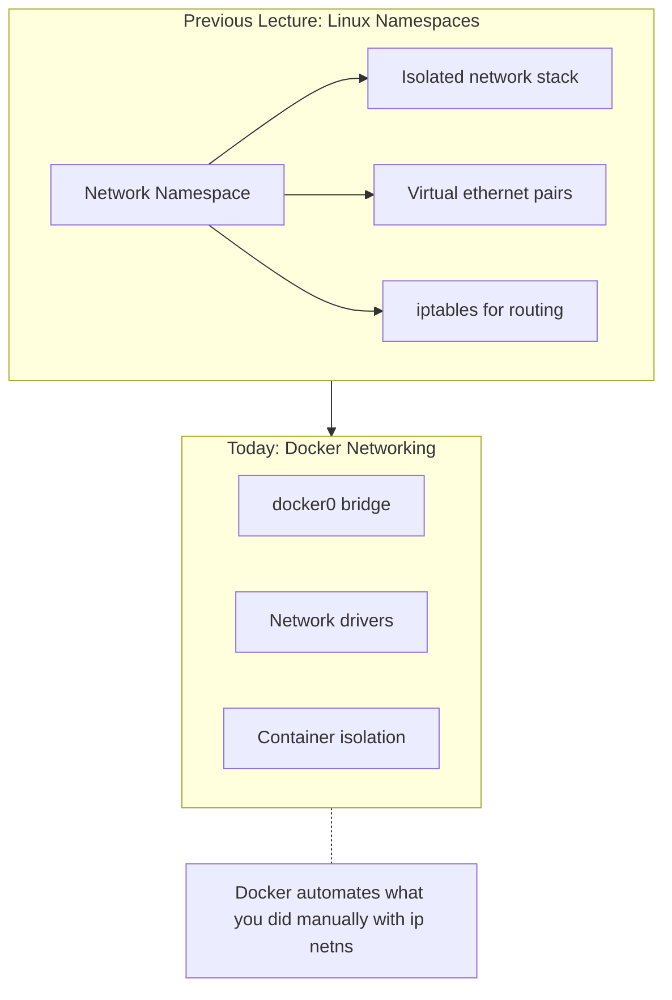
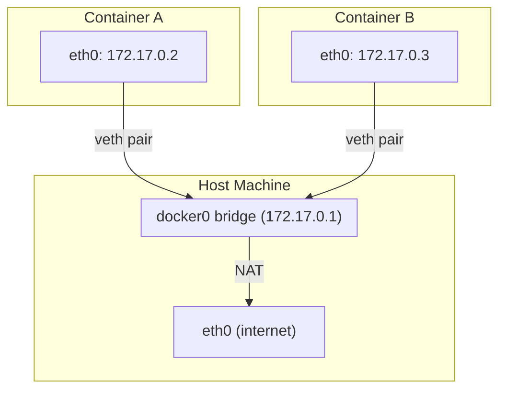
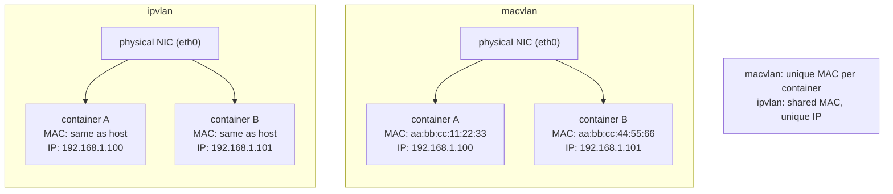
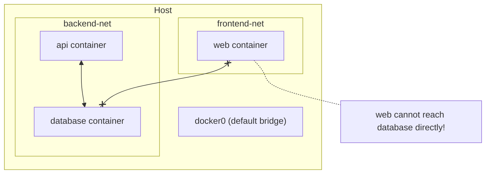
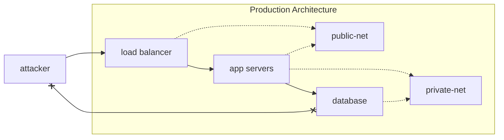
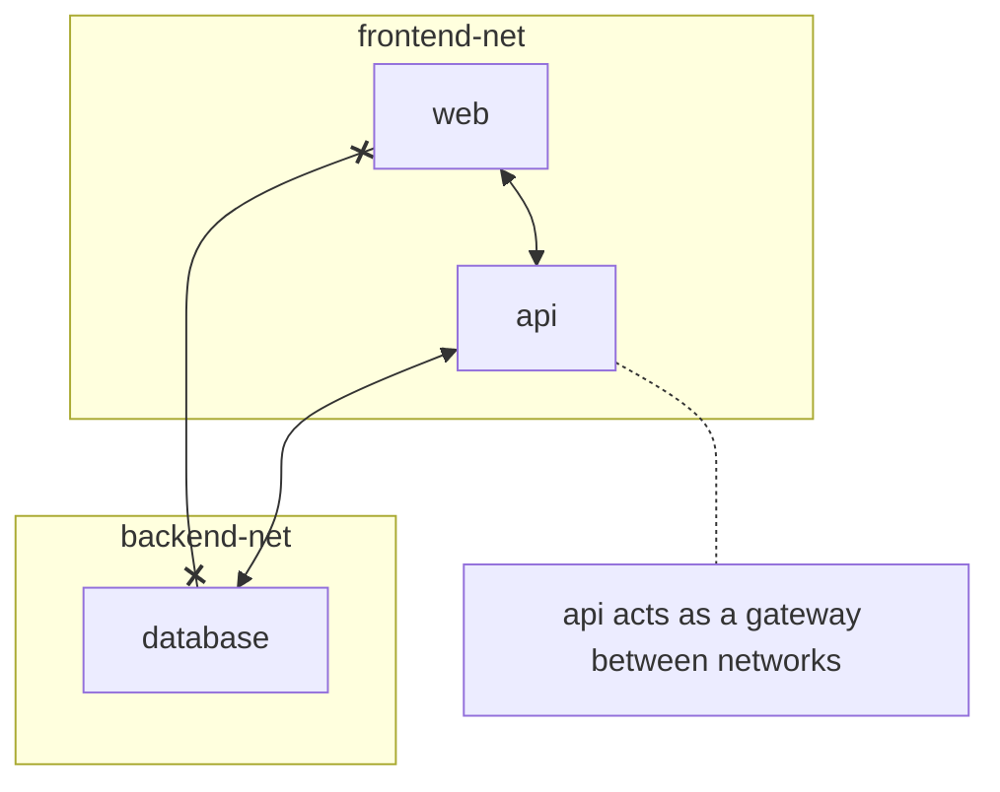
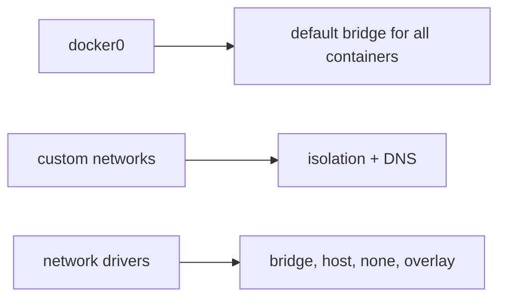

# Docker Networking

---

## Part 1: Connection to Fundamentals

### Whiteboard: Remember Network Namespaces?



**Key point:** "You created network namespaces with `ip netns add`. Docker does this automatically for every container."

**Discussion:**
- "What happened when you created a network namespace? Could it talk to the host?"
- "How did you connect two namespaces together?"

---

## Part 2: The docker0 Bridge

### Terminal Demo - Inspect docker0

```bash
# show network interfaces on host
ip addr show docker0

# show bridge details
bridge link show

# run a container and watch what happens
docker run -d --name web nginx

# show new veth pair appeared
ip addr | grep veth

# inspect container's network
docker exec web ip addr

# show the bridge connections
bridge link show
```

### Whiteboard: docker0 Architecture



**Key points:**
- docker0 is a linux bridge (virtual switch)
- each container gets a veth pair (one end in container, one on bridge)
- containers on same bridge can talk to each other
- NAT handles outbound traffic to internet

**Discussion:** "Why is this similar to plugging computers into a network switch?"

---

## Part 3: Network Driver Types

### Whiteboard: Docker Network Drivers

```mermaid
flowchart TB
    subgraph DRIVERS["Network Drivers"]
        direction TB

        BRIDGE["bridge (default)"]
        BRIDGE --> B1["containers on same host"]
        BRIDGE --> B2["isolated from host network"]

        HOST["host"]
        HOST --> H1["container uses host network directly"]
        HOST --> H2["no isolation, best performance"]

        NONE["none"]
        NONE --> N1["no networking at all"]
        NONE --> N2["fully isolated container"]

        OVERLAY["overlay"]
        OVERLAY --> O1["containers across multiple hosts"]
        OVERLAY --> O2["used in docker swarm/k8s"]

        MACVLAN["macvlan"]
        MACVLAN --> M1["container gets real MAC address"]
        MACVLAN --> M2["appears as physical device on LAN"]

        IPVLAN["ipvlan"]
        IPVLAN --> I1["containers share host MAC"]
        IPVLAN --> I2["each gets unique IP on LAN"]
    end
```



### Terminal Demo - Network Drivers

```bash
# list existing networks
docker network ls

# inspect the default bridge
docker network inspect bridge

# run container with host networking
docker run --rm --network host nginx &
curl localhost:80
# nginx is directly on host port 80!

# run container with no networking
docker run --rm --network none alpine ip addr
# only loopback, no external connectivity
```

### Whiteboard: When to Use Each Driver

| Driver | Use Case |
|--------|----------|
| bridge | default, most containers |
| host | performance-critical, no port mapping needed |
| none | security, batch jobs with no network |
| overlay | multi-host clusters |
| macvlan | container needs to appear as physical device on LAN |
| ipvlan | like macvlan but switches that block MAC spoofing |

### Whiteboard: macvlan vs ipvlan



**Discussion:** "When might your network switch block macvlan traffic?" (MAC spoofing protection, some cloud providers)

---

## Part 4: Network Isolation

### Whiteboard: Custom Bridge Networks



**Key insight:** custom networks provide isolation - containers on different networks cannot communicate by default

### Terminal Demo - Network Isolation

```bash
# create two separate networks
docker network create frontend
docker network create backend

# run containers on frontend network
docker run -d --name web --network frontend nginx

# run containers on backend network
docker run -d --name api --network backend alpine sleep 3600
docker run -d --name db --network backend alpine sleep 3600

# test: can api reach db? (same network)
docker exec api ping -c 2 db
# works! containers on same network can communicate by name

# test: can web reach db? (different network)
docker exec web ping -c 2 db
# fails! different networks are isolated

# test: can web reach api?
docker exec web ping -c 2 api
# also fails!

# show network details
docker network inspect frontend
docker network inspect backend
```

### Whiteboard: Why Isolation Matters



**Discussion:**
- "If an attacker compromises the load balancer, can they reach the database?"
- "How is this similar to VLANs in traditional networking?"

---

## Part 5: Connecting Networks

### Terminal Demo - Multi-Network Containers

```bash
# a container can be on multiple networks
docker network connect frontend api

# now api can talk to both networks
docker exec api ping -c 2 db    # backend - still works
docker exec api ping -c 2 web   # frontend - now works!

# but web still can't reach db
docker exec web ping -c 2 db    # still fails

# cleanup
docker stop web api db
docker rm web api db
docker network rm frontend backend
```

### Whiteboard: Multi-Network Pattern



---

## Part 6: DNS and Service Discovery

### Terminal Demo - Container DNS

```bash
# create a network
docker network create myapp

# run containers
docker run -d --name redis --network myapp redis:alpine
docker run -d --name app --network myapp alpine sleep 3600

# containers can reach each other by name!
docker exec app ping -c 2 redis

# this works because docker runs an embedded DNS server
docker exec app cat /etc/resolv.conf
# nameserver 127.0.0.11 <- docker's DNS

# cleanup
docker stop redis app && docker rm redis app
docker network rm myapp
```

**Key point:** custom bridge networks get automatic DNS - containers can use names instead of IPs

---

## Wrap-up

### Whiteboard: Docker Networking Cheat Sheet

| Command | Description |
|---------|-------------|
| `docker network ls` | list networks |
| `docker network create NAME` | create custom network |
| `docker network inspect NAME` | show network details |
| `docker run --network NAME` | attach container to network |
| `docker network connect NET CONTAINER` | add container to network |

### Key Takeaways



**Discussion:**
- "When would you use the default bridge vs a custom network?"
- "How does network isolation help with security?"
