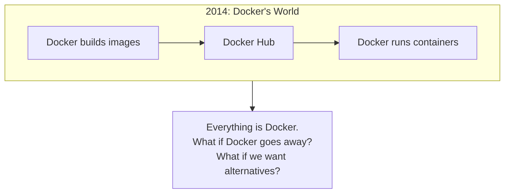
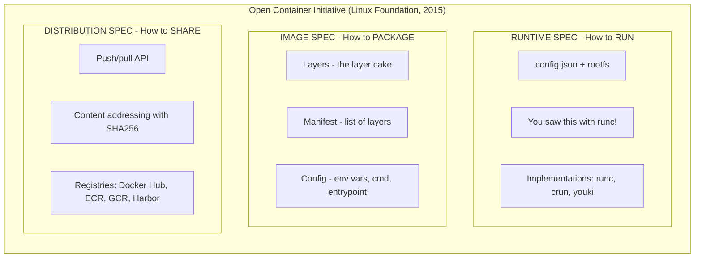
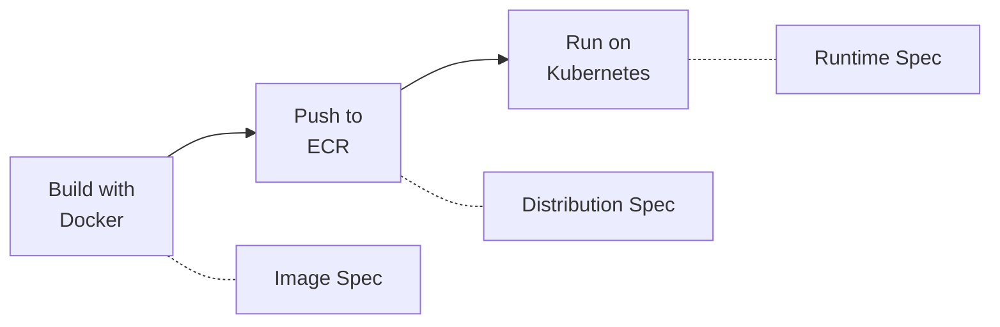
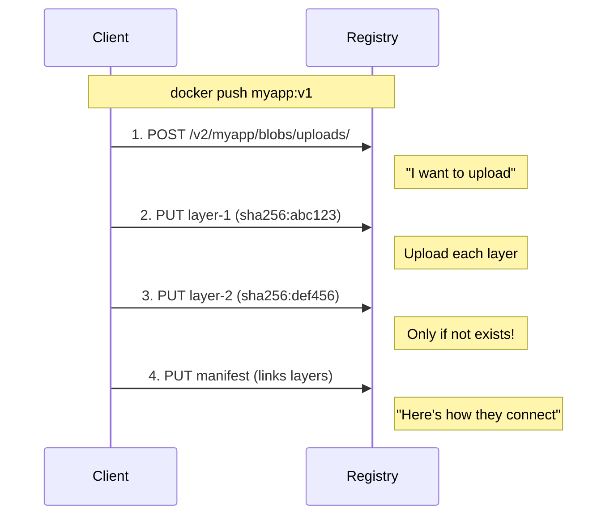
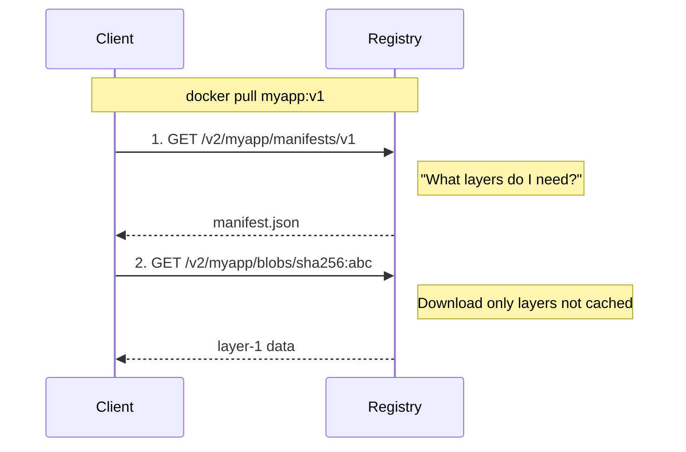
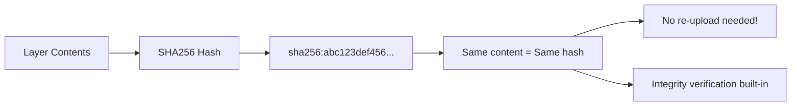
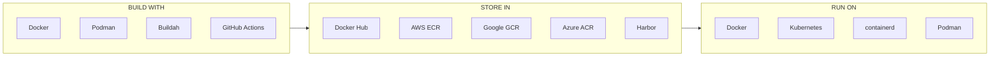

# OCI (Open Container Initiative) - Whiteboard Lesson Plan

## Part 1: The Problem

### Whiteboard: The 2014 Container World



**Discussion questions:**
- "What happens if you build with Docker but want to run on something else?"
- "Can Google's container tools read Docker's format?"
- "This is vendor lock-in"

**Key point to write:**

> 2015: Docker donates their formats to create open standards

---

## Part 2: The Three OCI Specs

### Whiteboard: OCI Specifications



### Whiteboard: The Interoperability Flow



**Key point to write in different color:**

> ALL INTEROPERABLE because of OCI!

---

## Part 3: Distribution Spec Deep Dive

### Whiteboard: Push Flow



### Whiteboard: Pull Flow



### Whiteboard: Content Addressing



**Key insight to write:**

- Layer identified by hash of contents
- Same content = same hash = no re-upload
- Integrity verification built-in

**Discussion:** "What happens if you push the same image twice?" (Nothing uploads, layers already exist)

---

## Part 4: Why This Matters

### Whiteboard: The Ecosystem



**Final key point:**

> OCI = The reason containers became an industry standard, not just "Docker"
>
> ALL COMPATIBLE! No vendor lock-in.

---

## Demo

```bash
# Show that an image is just a manifest + layers
docker pull nginx:alpine
docker inspect nginx:alpine | jq '.[0].RootFS.Layers'

# See the manifest
docker manifest inspect nginx:alpine

# Show content-addressable storage
ls -la /var/lib/docker/image/overlay2/layerdb/sha256/
```
